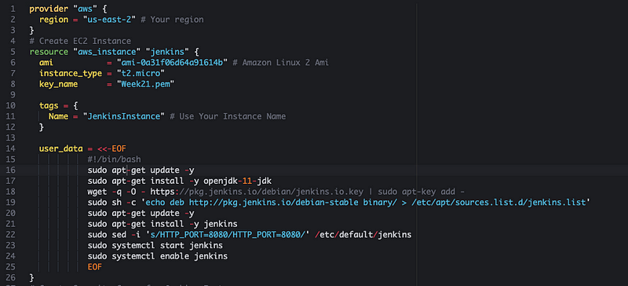
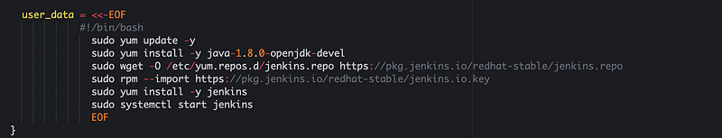
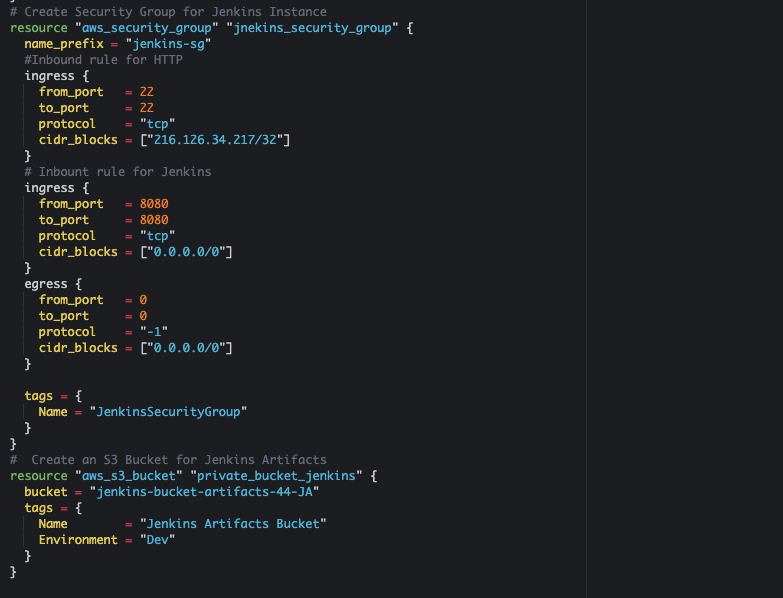
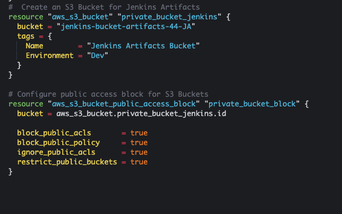
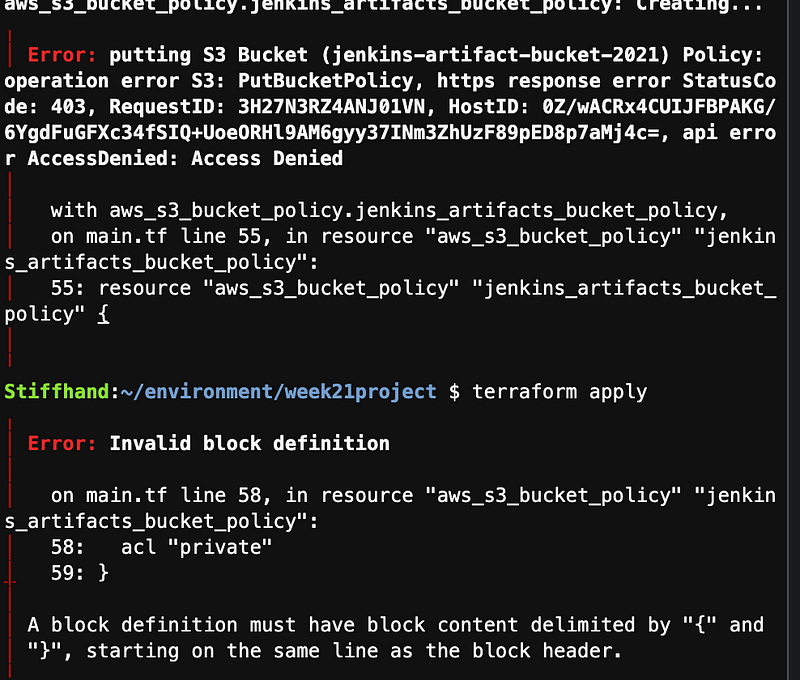
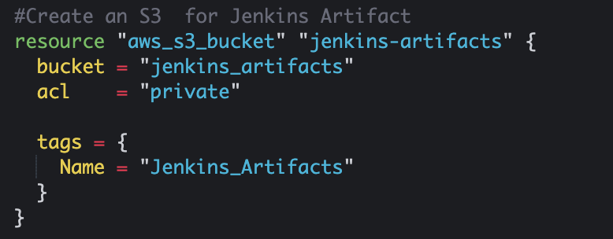

# Jenkins Deployment

In the following document, I will outline the trial-and-error process for creating an EC2 instance that installs and starts Jenkins while also creating an S3 bucket and security group for the instance. For this project, I will be using Cloud9 with Terraform installed on the system.

Let's Get Started!!

### Step: 1 
Login into your OS and make sure terraform is installed if it isn't you can use the following link to see how to download on your OS https://www.terraform.io/

### Step: 2 Creating EC2 instance with user data script

The following is showing how to create an Instance. Tip to find your ami from your region go to AMI Catalog on aws and search Amazon Linux 2 there will be two codes one for x64 and x86 I chose x64.

Closer look at User Data script

### Step: 3 Creating your security group

In the following picture, you see a script written in Terraform that sets up a security group for Jenkins.

This security group allows Jenkins to run safely by controlling who can access it. It sets rules to ensure that only the right connections can reach the Jenkins server, helping to protect it from unwanted access.

### Step: 4 Create S3 Bucket

For this section I did run into an error with the acl The writing above shows the now formatting for the creation to go through but the writing below show the before error and code I had. Although my solution was to just delete the middle coding I had I thought it would be valuable to share.

This code as a whole was stopping my process of Terraform apply.

### Step: 5 Testing the code

Run the following commands in your terminal 

After running these codes, you should see "Apply complete" and be able to check on AWS to see all that Terraform has accomplished.

# Hope you enjoyed!